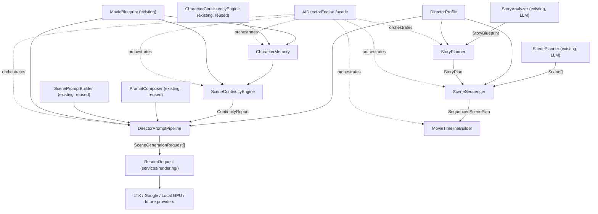

# AI Director Engine Architecture

Status: **Sprint 6 — architecture and business logic, verified end-to-end,
zero AI model calls.** Every class in `services/ai/director-engine/` is
real, tested, and makes no network call and no LLM call — confirmed by
inspection (no `LanguageModelProvider`, no vendor SDK import anywhere in the
directory) and by an 18-assertion verification run against a realistic
fixture. Nothing in `services/ai/director/`, `services/ai/production/`,
Movie Studio UI, or any rendering provider was modified.

## Why this isn't a rewrite of the existing director/production layers

Before writing any code this sprint, the codebase was surveyed in depth
because several objective names (**Story Planner**, **Scene Planner**,
**Prompt Composer**) are extremely close to classes that already exist and
already work:

- `services/ai/director/StoryAnalyzer.ts` already turns a user idea into a
  `StoryBlueprint` via a real, injected `LanguageModelProvider` call.
- `services/ai/director/ScenePlanner.ts` already drafts `Scene[]` (cast,
  environment, dialogue placeholders) via a real LLM call, joining each
  scene to its `CameraPlan`/`EmotionPlan` purely by `sceneNumber` — already
  deterministic, non-LLM logic.
- `services/ai/production/PromptComposer.ts` already deterministically
  composes one cinematic prompt string per scene from a `MovieBlueprint` —
  already pure string composition, zero LLM calls, zero network access.
- `services/ai/production/CharacterConsistencyEngine.ts` already derives a
  per-character consistency profile (`CharacterConsistencyPack`) — the
  closest existing analog to "Character Memory," but rebuilt fresh per
  `MovieBlueprint` with no persistence across scenes.

Given this sprint's explicit rule — **do not implement AI model calls** —
none of the above could be reimplemented without either duplicating
deterministic logic that already exists, or (worse) quietly reintroducing a
second LLM-calling seam. So every module in `services/ai/director-engine/`
either (a) is a genuinely new concept with no prior implementation
(`DirectorProfile`, persistent `CharacterMemory`, `SceneContinuityEngine`,
pre-production `MovieTimelineBuilder`), or (b) composes with an existing
deterministic class instead of re-deriving its output (`StoryPlanner` takes
an already-produced `StoryBlueprint`; `SceneSequencer` takes an
already-drafted `Scene[]`; `DirectorPromptPipeline` wraps `PromptComposer` +
`ScenePromptBuilder` directly).

## Architecture



Solid arrows are real data flow verified this sprint. Dashed arrows are
`AIDirectorEngine`'s orchestration calls. Nothing calls `StoryAnalyzer` or
`ScenePlanner` from this new layer — both remain exactly where they are,
called elsewhere (unchanged) to produce the inputs this layer consumes.

## The seven objectives, mapped

1. **Story Planner** → `StoryPlanner.plan(story, profile): StoryPlan` —
   deterministically splits `StoryBlueprint.estimatedSceneCount` into a
   classic ~25/50/25 three-act structure (Setup / Confrontation /
   Resolution), each act's scene-number range, purpose, and pacing
   guidance. Verified: a 4-scene story splits into acts `[1-1, 2-3, 4-4]`.

2. **Scene Planner** → `SceneSequencer.sequence(scenes, storyPlan, profile):
   SequencedScenePlan` — assigns each already-drafted `Scene` to its act
   (by `sceneNumber` range lookup) and computes a target duration
   (`Scene.durationSeconds` if set, else `StoryPlan.baseSceneDurationSeconds`,
   biased by the profile's `sceneDurationBiasSeconds`, clamped to 2-60s).

3. **Character Memory** → `CharacterMemory` — wraps
   `CharacterConsistencyEngine` (`remember()` delegates straight to
   `buildConsistencyPack()`) and adds what that engine doesn't have: a
   persistent (in-memory) `CharacterAppearanceLogEntry[]` per character,
   recording every scene they were logged into with a timestamp and the
   canonical reference prompt used at the time.

4. **Scene Continuity** → `SceneContinuityEngine.check(movie, memory):
   ContinuityReport` — four deterministic, rule-based checks: `CHARACTER_GAP`
   (ERROR — a character never featured in any scene), `ENVIRONMENT_JUMP`
   (WARNING — consecutive scenes change environment with
   `SceneTransition.None` declared), `TIME_OF_DAY_JUMP` (WARNING —
   same-environment consecutive scenes with different resolved
   `TimeOfDay`), `MISSING_CONTINUITY_NOTES` (WARNING — an environment reused
   across scenes with no `continuityNotes`). Verified both ways: a healthy
   fixture correctly reports `isConsistent: true` (with one real WARNING),
   and deliberately removing a character from every scene flips it to
   `false` with a real `CHARACTER_GAP` ERROR.

5. **Prompt Composer** → `DirectorPromptPipeline.compose(movie,
   referencePromptPlan, profile, continuity): DirectorPromptResult` — see
   the dedicated section below; this is the sprint's centerpiece.

6. **Director Profiles** → `DirectorProfile` + `DirectorProfileRegistry` —
   a plain data preset (pacing, prompt style/negative modifiers, camera
   shot/movement bias, emotional intensity bias, scene duration bias),
   deliberately *not* an LLM persona prompt (unlike the legacy,
   unwired `services/movie/directorPrompt.ts`'s "you are simultaneously
   Christopher Nolan, James Cameron..." approach) — every profile is a
   fixed parameter set consumed by pure functions elsewhere in this
   directory. Three real presets ship today (`CINEMATIC_DRAMA`,
   `FAST_PACED_ACTION`, `INTIMATE_INDIE`); the registry accepts custom ones
   via `register()`.

7. **Movie Timeline** → `MovieTimelineBuilder.build(sequencedPlan):
   MovieTimelinePlan` — cumulative `plannedStartSeconds`/`plannedEndSeconds`
   per scene, computed *before* any rendering happens. Not the same concept
   as `services/ai/production/MovieAssembler.ts`'s `MovieTimeline`, which is
   built *after* rendering from real video durations — that class is
   untouched and remains the source of truth once videos actually exist.
   Verified: cumulative arithmetic checked scene-by-scene (`entry[i].start
   === entry[i-1].end` for every pair).

## The provider-independent prompt pipeline (the sprint's key architectural point)

`DirectorPromptPipeline` does not invent a new prompt format. It:

1. Calls the **existing, untouched** `PromptComposer.composeScenePrompt()`
   and `ScenePromptBuilder.buildSceneRequests()` to get a real
   `SceneGenerationRequest[]` — the exact type already used in production.
2. Appends `DirectorProfile.promptStyleModifiers` to each `positivePrompt`
   and `DirectorProfile.negativePromptModifiers` + relevant
   `ContinuityReport` warnings to each `negativePrompt` — string
   concatenation only, same fields, same shape.
3. Returns `SceneGenerationRequest[]` — nothing new.

This matters because `services/ai/orchestration/MovieProductionService.ts`'s
`generateSceneVideo()` **already** converts exactly that type into
`RenderOrchestrator`'s provider-independent `RenderRequest`:

```ts
// MovieProductionService.ts, unchanged since Sprint 2:
const result = await this.renderOrchestrator.renderAndWait({
  prompt: request.positivePrompt,
  negativePrompt: request.negativePrompt,
  aspectRatio: request.aspectRatio,
  durationSeconds: request.expectedDuration,
  quality: request.quality,
});
```

Verified this sprint: a `DirectorPromptPipeline`-enriched
`SceneGenerationRequest` maps cleanly onto that exact `RenderRequest` shape
with a straight field copy — no adapter, no translation layer, no new type.
Because `RenderOrchestrator` → `ProviderRegistry` already treats every
provider identically (see `docs/architecture/render-orchestrator.md`), **any
provider that already speaks `RenderRequest` automatically receives
director-profile-enriched, continuity-aware prompts for free** — LTX,
Google, and Local GPU today; Wan, CogVideoX, Hunyuan, or any future provider
tomorrow, the moment it's registered in `ProviderRegistry` the same way
Sprint 1 already established. Nothing about adding a new provider requires
touching `services/ai/director-engine/` at all — the enrichment happens
before a `RenderRequest` is ever built, so no provider is aware this layer
exists.

## Backward compatibility

Zero changes to `services/ai/director/*`, `services/ai/production/*`,
`services/ai/orchestration/*`, `services/rendering/*`, any API route, or any
UI. `services/ai/director-engine/` is an entirely new, additive directory.
`AIDirectorEngine.plan()` is not called from `MovieProductionService` or any
route this sprint — wiring it in (replacing/augmenting
`runStoryPlanningStage()`'s output with a `StoryPlan`, or having
`runScenePromptStage()` call `DirectorPromptPipeline` instead of
`ScenePromptBuilder` directly) is a scoped follow-up, not done here.
