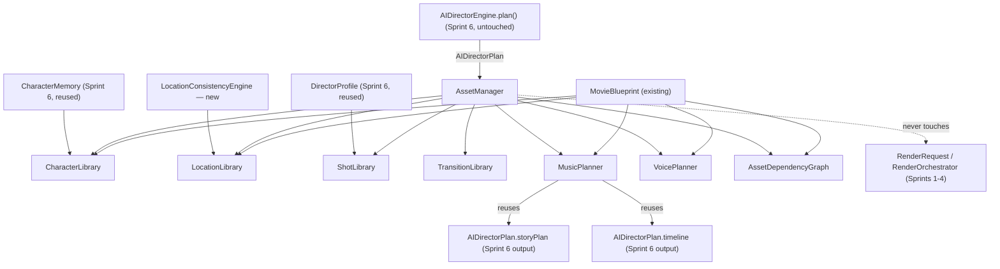

# Asset Intelligence Layer Architecture

Status: **Sprint 7 — architecture and business logic, verified end-to-end,
zero AI model calls, zero media generation.** Every class in
`services/ai/asset-intelligence/` is real and tested — confirmed by a
20-assertion verification run that first executes the actual, untouched
Sprint 6 `AIDirectorEngine` and feeds its real output straight into the new
`AssetManager`. No UI, API route, rendering provider, or existing
director/production/director-engine file was modified.

## Survey before design

Before writing any code, the existing codebase was checked for prior art,
because several objective names overlap with things that already exist:

- **Asset Manager**: `app/(dashboard)/asset-manager/` already exists — a
  read-only gallery UI over `ProductionArtifact` (via `/api/workflow/list`).
  Untouched this sprint (no UI/API changes). This sprint's `AssetManager`
  is a different layer entirely: a planning-time catalog, not a
  post-generation gallery.
- **Character Memory / Library**: `services/ai/director-engine/CharacterMemory.ts`
  (Sprint 6) already exists and is reused directly — not reimplemented.
- **Voice**: `Character.voiceProfile` and per-scene `VoiceActorAssignment[]`
  are already populated deterministically by the real (LLM-backed)
  `services/ai/director/ScenePlanner.ts`. `services/ai/providers/audio/ElevenLabsService.ts`
  (the only real TTS seam) remains fully unconfigured
  (`NotConfiguredAudioClient`, confirmed unchanged) — never called here.
- **Music**: confirmed zero existing music-generation service anywhere in
  the codebase — `MusicPlanner` is genuinely new, planning-only.
- **Library / Dependency Graph**: confirmed zero existing
  `CharacterLibrary`/`LocationLibrary`/`ShotLibrary`/`TransitionLibrary`/
  `AssetDependencyGraph` concept anywhere (the three existing "*Library*"
  routes — Asset Manager, Movie Library, Media Library — are all
  read-only dashboard pages, not service-layer abstractions).

## Architecture

## The eight objectives, mapped

1. **Asset Manager** → `AssetManager.catalog(movie, directorPlan): AssetCatalog`
   — the facade, mirroring `AIDirectorEngine`'s role one layer up. Takes an
   **already-computed** `AIDirectorPlan` as input rather than recomputing
   any of it.

2. **Character Library** → `CharacterLibrary` — wraps `CharacterMemory`
   (Sprint 6, reused via composition, not duplicated) and adds what it
   doesn't have: a catalog spanning *multiple* movies, tracking
   `movieIds`/`registrationCount` per character. Verified: registering the
   same character twice (simulating reuse across two productions) increments
   `registrationCount` to 2.

3. **Location Library** → `LocationLibrary` + new `LocationConsistencyEngine`
   — `CharacterConsistencyEngine` is Character-only (confirmed by
   inspection), so there was nothing to reuse for locations.
   `LocationConsistencyEngine` mirrors its shape (build-once-query-many,
   deterministic summaries, a reference prompt) but is new code. Verified:
   real `continuityNotes` text flows through to the catalog entry.

4. **Shot Library** → `ShotLibrary` — 8 curated `ShotPreset`s,
   `matchCameraPlan()` against real `CameraPlan`s and `recommendFor()`
   against a `DirectorProfile` (Sprint 6, reused). Verified: the fixture's
   medium-shot/static camera plans matched the `dialogue-medium` preset.

5. **Transition Library** → `TransitionLibrary` — one guidance entry per
   `SceneTransition` enum value (8 total), pure lookup.

6. **Music Planner** → `MusicPlanner.plan(movie, storyPlan, timeline): MusicPlan`
   — reuses `AIDirectorPlan.storyPlan`/`.timeline` (Sprint 6 output, not
   recomputed). Where `ScenePlanner` already populated `Scene.backgroundMusic`
   (real LLM direction), that cue is kept verbatim (`source: "EXISTING"`);
   gaps are filled deterministically from each scene's `EmotionPlan` plus
   `StoryPlan.overallPacing` as a real tempo signal (`source: "DERIVED"`).
   No audio is generated or fetched — every cue is planning data
   (`style`/`moodTags`/`volume`), never a real track.

7. **Voice Planner** → `VoicePlanner.plan(movie): VoicePlan` — validates
   (never regenerates) the real `VoiceActorAssignment[]` `ScenePlanner`
   already derives: every character with a `DialogueLine` in a scene must
   have a matching assignment in that scene. Verified both ways — a clean
   fixture reports zero issues, and removing one scene's assignments
   surfaces exactly one real `VoicePlanIssue`. `ElevenLabsService` is never
   imported.

8. **Asset Dependency Graph** → `AssetDependencyGraph` — a real DAG built
   only from `OutputSchema.ts`'s existing id-reference fields
   (`Scene.characterIds`/`environmentId`/`cameraPlanId`/`emotionPlanId`,
   `Character.referenceImages`, `Environment.referenceImages`) — no new
   entity relationships invented. `topologicalOrder()` (Kahn's algorithm)
   and `readinessFor(id)` (ancestor traversal) are real graph algorithms,
   not stubs. Verified: character/reference-image nodes provably precede
   the scenes that depend on them in topological order, and
   `readinessFor("scene-2")` returned exactly its real 7 prerequisite
   entities.

## Backward compatibility

Zero changes to `services/ai/director/*`, `services/ai/production/*`,
`services/ai/director-engine/*`, `services/ai/orchestration/*`,
`services/rendering/*`, `services/ai/providers/audio/ElevenLabsService.ts`,
any API route, or any UI. `services/ai/asset-intelligence/` is an entirely
new, additive directory. `AssetManager` is not called from
`MovieProductionService`, `AIDirectorEngine`, or any route this sprint.

## How this integrates with the AI Director Engine while staying invisible to rendering providers

`AssetManager.catalog()`'s only input beyond the raw `MovieBlueprint` is
`AIDirectorPlan` — the exact return type of `AIDirectorEngine.plan()`
(Sprint 6), consumed as data, never by re-invoking `StoryPlanner`,
`SceneSequencer`, or `MovieTimelineBuilder` a second time. That is the
literal meaning of "reuse the Director Engine, don't duplicate
StoryPlanner/CharacterMemory/Timeline" — this layer composes with the
*Director Engine's output*, not its classes run again.

Nothing in this layer ever constructs, imports, or references
`RenderRequest`, `RenderProvider`, `RenderOrchestrator`, or
`ProviderRegistry` (services/rendering/) — verified by the fact that no file
in `services/ai/asset-intelligence/` imports anything from
`services/rendering/`. The only thing every provider (LTX, Google, Local
GPU, and any future one) ever consumes is still exactly
`DirectorPromptPipeline`'s `SceneGenerationRequest[]` → `RenderRequest`, the
same mapping established in Sprint 6 and completely unchanged. The Asset
Intelligence Layer sits entirely alongside that pipeline — cataloging,
validating, and planning metadata a human or a future stage could consult
— without ever being positioned between `DirectorPromptPipeline` and a
provider. A provider could not detect this layer's existence even if it
tried: no field it ever receives originates from
`services/ai/asset-intelligence/`.
