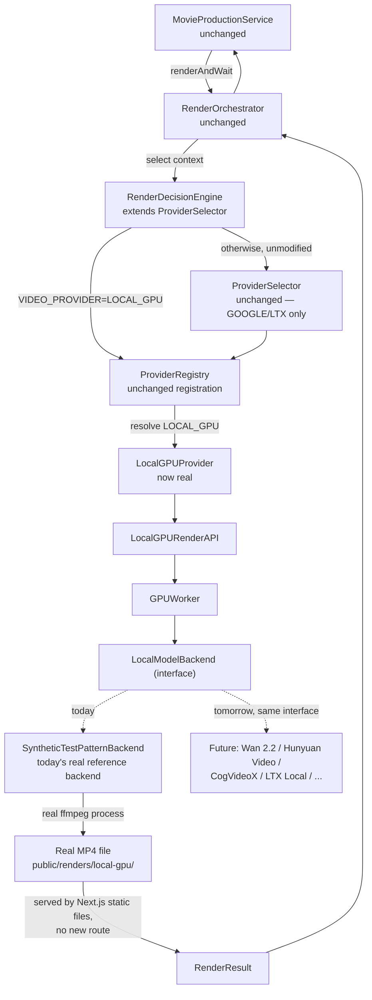

# Local GPU Provider Architecture

Status: **Sprint 4 — real, working, verified end-to-end.** `LocalGPUProvider`
is no longer a placeholder: it is a genuine, tested render provider, wired
into the exact same pipeline Movie Studio already uses for LTX and Google.
Setting `VIDEO_PROVIDER=LOCAL_GPU` makes `MovieProductionService` render
scenes through a local worker process instead of a cloud API — no other code
changes.

## An honest note on what "local GPU" means today

This machine has an integrated AMD Radeon GPU, no NVIDIA/CUDA hardware, and
no ROCm toolchain. No real video-diffusion model (Wan 2.2, Hunyuan Video,
CogVideoX, LTX Local, or any other) is installed or hardcoded anywhere in
this codebase — the mission explicitly reserves those for future sprints and
forbids hardcoding any of them now. So today's actual generation backend,
`SyntheticTestPatternBackend`, is a genuine, working **reference
implementation** of the model abstraction: it uses `ffmpeg` (installed this
sprint as `@ffmpeg-installer/ffmpeg`, the sibling of the `@ffprobe-installer/ffprobe`
package already used elsewhere in this project) to synthesize a real,
valid, playable H.264 MP4 locally on CPU. This is real, verifiable local
rendering — not a fabricated result — it is simply not yet backed by an AI
model. Swapping in a real one later means replacing exactly one class; see
Future Multi-GPU Strategy below.

Verified for real this sprint: real AMD GPU hardware detected via WMI
(`AMD Radeon(TM) Graphics`), a real submit → poll → download cycle, a real
27.9 KB H.264 MP4 produced at the exact requested 4s / 640×360, and real
mid-render cancellation (a live `ffmpeg` process actually killed via
`AbortController`, confirmed to never reach `COMPLETED` afterward).

## Architecture

## Request flow

1. `MovieProductionService.generateSceneVideo()` calls
   `RenderOrchestrator.renderAndWait(request)` — identical call, whichever
   provider ends up handling it.
2. `RenderOrchestrator` calls `this.selector.select(context)`. Since Sprint 4,
   `MovieProductionFactory.ts` constructs `RenderOrchestrator` with a
   `RenderDecisionEngine` (which `extends ProviderSelector`) instead of the
   Sprint 1 default — a real subclass, not a new type, so
   **`RenderOrchestrator.ts` itself required zero changes**.
3. `RenderDecisionEngine.select()` checks `VIDEO_PROVIDER` first: if it's
   `LOCAL_GPU`, returns `"LOCAL_GPU"` directly. Otherwise it calls
   `super.select(context)` — `ProviderSelector`'s own, completely unmodified
   `GOOGLE`/`LTX` logic. `ProviderSelector.ts` was not touched this sprint.
4. `RenderOrchestrator` resolves `"LOCAL_GPU"` via `ProviderRegistry` —
   already registered since Sprint 1
   (`createDefaultProviderRegistry()`); no registry change was needed. It
   now constructs a real `LocalGPUProvider` instead of the old
   `NotImplementedRenderProvider` placeholder.
5. `LocalGPUProvider.generate()` forwards straight to
   `LocalGPURenderAPI.submit()`. `checkStatus()`/`download()` forward to
   `status()`/`download()` the same way — no translation logic of its own,
   since `LocalGPURenderAPI` already speaks `RenderResult` natively.
6. `RenderOrchestrator.renderAndWait()` polls exactly as it already does for
   LTX/Google — no special-casing for the local case anywhere in that method.

## Worker flow

`GPUWorker` is the actual execution engine, constructed once per
`LocalGPUProvider` instance with an injected `LocalModelBackend`:

1. `submit(request)` generates a `jobId` (`crypto.randomUUID()`), records a
   `WorkerJobRecord` in `PENDING`, and kicks off `runJob()` without awaiting
   it — the caller gets the `jobId` back immediately, matching every other
   provider's async submit-then-poll shape.
2. `runJob()` flips the record to `PROCESSING`, calls
   `backend.generate(request, signal)` (an `AbortController`'s signal, for
   real cancellation — see Failure Handling), and on success stores the
   real `LocalRenderOutput` (file path, public URL, and the *actual*
   ffprobe-measured duration/resolution, not just an echo of the request)
   before flipping to `COMPLETED`.
3. `getWorkerStatus()` reports genuine state: `busy`/`idle` from a real
   in-flight counter, `queueDepth`/`currentJobIds` from real pending/
   processing records, `version` (a real constant), `modelName` (the
   injected backend's own name), and `gpuInfo` (real WMI-detected
   hardware — `detectSystemGPU()`, shared with `GPUManager` so the
   detection logic exists exactly once).
4. `getHeartbeat()` adds the fuller telemetry surface: timestamp, queue
   depth, running jobs, worker version, and VRAM total (real, from WMI) —
   with `temperatureCelsius`/`utilizationPercent` left honestly `undefined`,
   since no real GPU telemetry source (nvidia-smi/rocm-smi or equivalent)
   exists on this machine or in this codebase.

`LocalGPURenderAPI` sits directly on top of `GPUWorker`, translating its
`WorkerJobStatus` (`PENDING`/`PROCESSING`/`COMPLETED`/`FAILED`/`CANCELLED`)
into `RenderResult`'s `RenderStatus` (`CANCELLED` maps to `FAILED` with
`error: "Render was cancelled."`, since `RenderResult`'s status union has no
dedicated cancelled value — the same limitation any provider would have).

## Failure handling

- **Backend throws** (e.g. `ffmpeg` exits non-zero): `runJob()`'s `catch`
  records the real error message on the job and flips it to `FAILED`;
  `LocalGPURenderAPI` surfaces it as `RenderResult.error`, identical to how
  a real LTX/Google failure surfaces.
- **Cancellation**: `LocalGPURenderAPI.cancel()` → `GPUWorker.cancel()`
  aborts that job's `AbortController`. `SyntheticTestPatternBackend`
  listens for the abort signal and calls `.kill()` on the actual `ffmpeg`
  child process — verified this sprint: a 20-second render, cancelled ~300ms
  in, never reached `COMPLETED`. `runJob()` checks
  `this.isCancelled(jobId)` (a fresh map read, not the narrowed local
  variable) before writing a result, so a cancellation that lands while the
  backend call is still resolving can't be silently overwritten by a late
  success/failure.
- **Worker health**: `getWorkerStatus().health` is `"HEALTHY"` whenever the
  process can respond at all — there is no lower-level failure mode to
  detect yet (no GPU driver crash, no OOM signal) because there is no real
  GPU workload yet. `GPUManager.getGPUHealth()` is honest about the two
  distinct facts it knows: whether a worker is configured at all, and
  whether real GPU hardware was detected on the machine — never conflating
  "a worker exists" with "there's real GPU capability behind it."
- **No worker configured**: `GPUManager`'s `isAvailable()`/
  `getGPUHealth()`/`getMemoryUsage()`/`getQueueDepth()` all return honest
  empty/false values, and `estimateRenderTime()`/`estimateRenderCost()`
  throw — never a fabricated success, per this sprint's explicit
  requirement.

## Future multi-GPU strategy

Nothing in this sprint implements multi-GPU, Kubernetes, Docker Swarm, or
cloud GPU — by design, those are future sprints. What this sprint's
architecture makes possible without a rewrite:

- **New local models plug in by implementing `LocalModelBackend`** — one
  method, `generate(request, signal): Promise<LocalRenderOutput>`. Wan 2.2,
  Hunyuan Video, CogVideoX, LTX Local, or any future open-source model
  becomes a new class in `services/gpu/backends/`, passed into
  `GPUWorker`'s constructor in place of `SyntheticTestPatternBackend` — zero
  changes to `GPUWorker`, `LocalGPURenderAPI`, `LocalGPUProvider`, or
  anything above them.
- **Multiple GPUs on one machine**: `GPUWorker` already tracks concurrent
  jobs via `busyCount`/`currentJobIds` rather than assuming exactly one
  in-flight job — a future multi-GPU-aware backend could accept several
  concurrent `generate()` calls (one per physical GPU) without `GPUWorker`'s
  public shape changing.
- **A GPU cluster**: `providers/gpu/GPUClusterProvider.ts` (Sprint 1's other
  placeholder) is a separate `RenderProvider` — a future cluster
  implementation would follow this exact same pattern (a `*RenderAPI` class
  speaking `RenderResult` natively, or a `BaseVeoClientProvider`-style
  adapter if it happens to speak the `VeoClient` shape instead), registered
  under `"GPU_CLUSTER"` in the already-existing `ProviderRegistry` slot.
- **GPU-aware automatic routing** (not just today's explicit
  `VIDEO_PROVIDER=LOCAL_GPU` opt-in): `RenderDecisionEngine.select()`
  already documents, in priority order, exactly what Sprint 5+ needs to
  add — `GPUManager.estimateRenderCost()`/`isAvailable()`,
  `CostIntelligence.estimateCost()`, `GPUManager.getQueueDepth()`, latency,
  priority, user plan, budget, and `ProviderHealthMonitor.getStatistics()`
  — all built in Sprint 3, none of it consulted by `select()` yet. Adding
  that logic is entirely inside `RenderDecisionEngine.select()`; nothing
  above `RenderOrchestrator` needs to change, because it already doesn't
  know which provider ran.

At every step, the reason Movie Studio never has to change is the same one
established since Sprint 1: `RenderResult` is the only shape that ever
crosses a `RenderProvider` boundary, and `RenderOrchestrator` is the only
thing that ever asks "which provider." Local GPU rendering slotting in
without touching Movie Studio isn't a coincidence this sprint — it's the
architecture doing exactly what it was built for.
