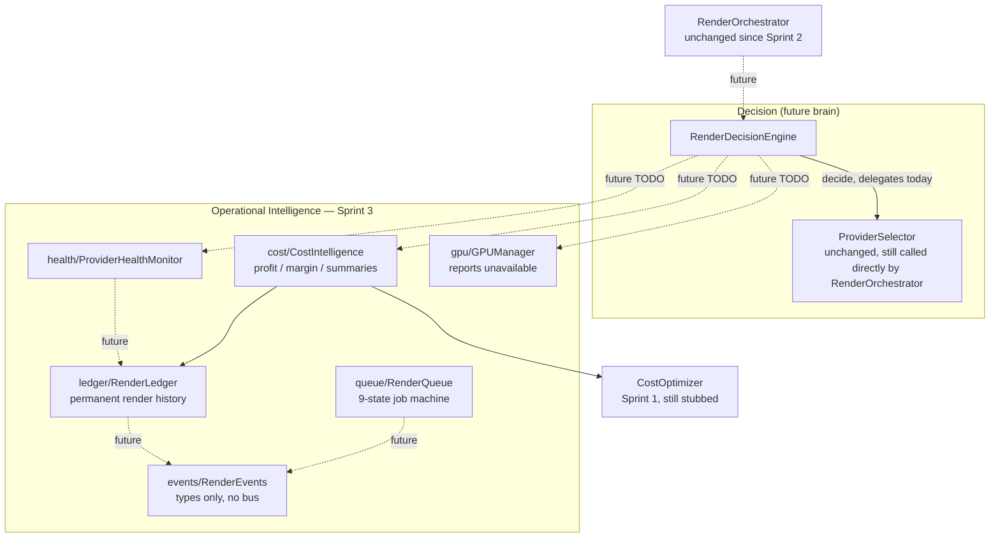

# Render Intelligence Architecture

Status: **Sprint 3 — architecture only, not wired in.** Every module described
here (`services/rendering/ledger/`, `cost/`, `queue/`, `gpu/`, `health/`,
`decision/`, `events/`, `types/`) compiles and is independently usable, but
**nothing calls any of it yet.** The real render path is still exactly what
Sprint 2 left it: `MovieProductionService.generateSceneVideo()` →
`RenderOrchestrator.renderAndWait()` → `ProviderSelector` → `ProviderRegistry`
→ `LTXCloudProvider` / `GoogleVeoProvider`. This document describes the
operational-intelligence layer that will sit alongside that path — recording
what happened, tracking cost, tracking provider health, and eventually
informing provider selection — without changing it.

## Why this exists

`RenderOrchestrator` (Sprint 1–2) answers "how do I run a render." This layer
answers the questions an enterprise render platform needs answered *around*
that: What did this render actually cost, and was it profitable? Which
provider is healthy right now? What's queued, and in what state? What would a
self-hosted GPU have cost instead, and is one even available? None of that
exists today — Sprint 3 builds the shape of the answers so Sprint 4+ can fill
in real data (GPU backends, pricing rules) without redesigning anything.

## Architecture diagram



Solid arrows are real dependencies that exist today (compiled, callable).
Dashed arrows are the wiring Sprint 4+ adds — this sprint builds the boxes,
not the dashed lines.

## Queue flow

`queue/RenderQueue.ts` is a **new, separate** in-memory job state machine —
not the pre-existing `services/ai/production/RenderQueue.ts` (a FIFO batch
queue over `VeoGenerator`, still used by `MovieProductionFactory.ts`,
untouched by this sprint; that older class's `RenderJob`/`RenderJobStatus`
are also distinct types, scoped to that file). The new queue is built around
the fuller state set a real scheduler needs:

```
QUEUED -> WAITING -> ASSIGNED -> RENDERING -> DOWNLOADING -> VERIFYING -> COMPLETED
                \          \          \             \             \
                 -----------------------> FAILED / CANCELLED (from any non-terminal state)
```

`RenderQueue.updateStatus()` validates every transition against this table —
an illegal jump (e.g. `QUEUED` straight to `COMPLETED`) throws
`RenderQueueError` rather than silently corrupting state. `enqueue()`,
`get()`, `list()`, `listByStatus()`, `incrementRetryCount()`, and `remove()`
round out the CRUD surface. No Redis, no BullMQ — a `Map<string, RenderJob>`,
same in-memory pattern as every other Sprint 1–3 store.

## Ledger flow

`ledger/RenderLedger.ts` is the permanent (in-memory, for now) record of every
render attempt: identity (`renderId`/`jobId`/`userId`/`projectId`/`sceneId`),
provider/model, requested vs. actual duration/resolution, start/end/
generation time, estimated/actual cost, credits charged, estimated profit,
status, retry count, `executionTarget` (`"CLOUD" | "GPU"`), and any error
message. `RenderLedgerEntry` reuses `RenderJobStatus` from `types/RenderJob.ts`
rather than inventing a second status enum.

This is the system of record `cost/CostIntelligence.ts`'s reporting methods
read from — `getByProvider()`, `getByUser()`, `getByProject()`,
`getByStatus()`, and `getByDateRange()` are the primitives every summary is
built on.

## Cost flow

`cost/CostIntelligence.ts` is the business-intelligence layer, and is
**provider-independent by construction** — every method takes/returns
`ProviderId` generically; nothing branches on `"LTX"` or `"GOOGLE"` anywhere
in the file.

- `estimateCost()` **delegates** to `CostOptimizer.estimateCost()` (Sprint 1)
  rather than reimplementing pricing — it still throws until real
  per-provider pricing exists. No duplicated "not implemented yet" logic.
- `recordActualCost()` writes a `RenderLedgerEntry` into the injected
  `RenderLedger`.
- `calculateProfit()` / `calculateMargin()` are real, implemented arithmetic
  (`revenue - cost`, `((revenue - cost) / revenue) * 100`) — these don't need
  provider pricing knowledge, just the two numbers.
- `providerStatistics()`, `dailySummary()`, `monthlySummary()`,
  `yearlySummary()` are **real aggregation** over `RenderLedger` entries
  (filtered by provider or date range) — render-time and success-rate fields
  are genuinely computed today; `averageCost`/`totalCost` are `undefined`
  until entries carry real `actualCost` values (Sprint 4+ pricing).

## Future GPU flow

`gpu/GPUManager.ts` is the capacity/health/cost query surface — distinct from
`providers/gpu/LocalGPUProvider.ts` and `providers/gpu/GPUClusterProvider.ts`
(the `RenderProvider` placeholders that would actually *execute* a render,
from Sprint 1). `GPUManager` is what a decision-maker consults *before*
routing to one of those providers: `isAvailable()`, `getGPUHealth()`,
`getMemoryUsage()`, `getQueueDepth()`, `estimateRenderTime()`,
`estimateRenderCost()`. Every method reports honestly today —
`isAvailable()` returns `false`, `estimateRenderTime()`/`estimateRenderCost()`
throw — because no self-hosted GPU backend exists yet. Sprint 4 replaces each
`TODO` with a real call into a GPU worker or cluster manager; the method
signatures don't need to change.

## Decision engine flow

`decision/RenderDecisionEngine.ts` is explicitly **not** a replacement for
`ProviderSelector` — the sprint requirement is that `ProviderSelector`
"must remain working" and is not removed, and it isn't: `RenderOrchestrator`
still calls `ProviderSelector.select()` directly, unchanged since Sprint 2.
`RenderDecisionEngine.decide()` today is a pure passthrough to that same
`ProviderSelector.select()` — identical outcome, zero behavior change.

Its purpose is to be the **future** decision point once GPU routing exists,
at which point `RenderOrchestrator` would call `RenderDecisionEngine.decide()`
instead of `ProviderSelector.select()` directly, and `decide()` would start
consulting (in roughly this order): GPU cost (`GPUManager.estimateRenderCost()`),
API cost (`CostIntelligence.estimateCost()`), GPU queue depth
(`GPUManager.getQueueDepth()`), latency budget, priority, user plan, budget
ceiling, and provider health (`ProviderHealthMonitor.getStatistics()`) —
every one of these is a documented TODO on `decide()` today, not yet
implemented.

## Provider health flow

`health/ProviderHealthMonitor.ts` collects `ProviderHealthObservation`
records (render time, queue time, success/failure, retried, cost) via
`record()`, and `getStatistics()`/`getAllStatistics()` compute real
per-provider aggregates: average render time, average queue time, success
rate, failure rate, retry rate, average cost, jobs completed, jobs failed —
all genuine arithmetic over recorded observations (0 with no data, never
fabricated). This is the "Provider Health" input
`RenderDecisionEngine.decide()`'s TODO list references — a provider whose
failure rate climbs becomes visible here before any routing logic reacts to
it.

## Enterprise scaling plan

The reason this sprint separates concerns into eight small modules instead of
one large "rendering ops" class is so each piece can be scaled or replaced
independently as real usage grows:

1. **Ledger → real database.** `RenderLedger`'s public shape
   (`record`/`getAll`/`getByX`) doesn't change when the private in-memory
   array is replaced by a real table — every consumer (`CostIntelligence`)
   keeps working unmodified.
2. **Queue → real scheduler.** `queue/RenderQueue`'s state machine is the
   contract a real scheduler (in-process worker pool, or eventually a
   distributed queue) implements against; `RenderJobStatus`'s 9 states are
   granular enough to represent GPU assignment/rendering/download/
   verification as distinct, individually observable phases.
3. **Cost → real billing.** `CostIntelligence` already separates "estimate/
   record" (delegated to `CostOptimizer`, where real pricing rules land) from
   "report" (real aggregation over the ledger) — pricing rules can be added
   without touching the reporting methods.
4. **GPU → real workers, then a cluster.** `GPUManager`'s six-method surface
   is deliberately backend-agnostic; a single local GPU and a multi-node
   cluster are both just different implementations behind the same
   `isAvailable()`/`getGPUHealth()`/`getQueueDepth()`/`estimate*()` contract,
   the same way `LocalGPUProvider` and `GPUClusterProvider` are both just
   `RenderProvider` implementations.
5. **Decision → real routing.** `RenderDecisionEngine` is where cost, health,
   GPU capacity, and business rules (plan, budget, priority) converge into
   one provider choice — swapping `RenderOrchestrator` from calling
   `ProviderSelector` to calling `RenderDecisionEngine` is a one-line change
   whenever that logic is ready, because `decide()` already returns the same
   `ProviderId` type `select()` does.
6. **Events → real event bus.** `RenderEvents.ts`'s typed union is what a
   future event bus would carry; queue transitions, ledger writes, and health
   observations can all become event-driven later without changing what an
   event *is*.

At every layer, the pattern is the same one established in Sprint 1: define
the interface and the honest "not implemented" behavior first, so real
implementations can be dropped in behind an unchanged contract — which is
exactly how ReelForge migrates from cloud APIs to self-hosted GPU rendering
without rewriting Movie Studio, Cartoon Studio, Cinema Studio, or Marketing
Studio.
