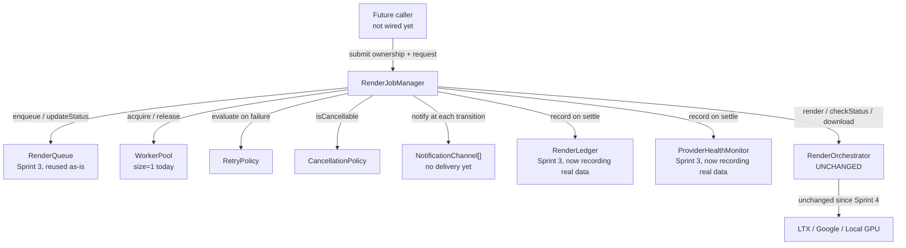

# Render Job Manager Architecture

Status: **Sprint 5 — architecture only, verified end-to-end, not wired in.**
`RenderJobManager` is a real, tested, standalone module. Nothing in
`MovieProductionService`, any API route, or `MovieProductionFactory.ts` calls
it yet — by explicit choice for this sprint. `RenderOrchestrator.ts` was not
modified; every render still goes through its existing `render()`/
`checkStatus()`/`download()` methods, unchanged since Sprint 4.

## Why this exists

Every sprint so far made a single render synchronous-from-the-caller's-
perspective: submit, wait, get a result. That doesn't scale operationally —
there's no durable record of "what jobs exist," no way to observe a render's
progress mid-flight, no bounded concurrency, no retry on transient failure,
no notification hook, and no record of who a render belongs to. This sprint
adds that operational layer, without touching how a render actually happens.

## Architecture

## Request flow

1. `submit(options)` — `{request, userId?, projectId?, sceneId?, assetId?, priority?, maxAttempts?}` — enqueues a `RenderJob` into `RenderQueue` (`QUEUED`), records that stage transition, fires a `JobQueued` notification, and returns immediately. It never awaits the render.
2. If a `WorkerPool` slot is free, processing starts right away (`tryStartNext()` → `runJob()`); otherwise the job waits in `QUEUED` until a slot frees up.
3. `runJob()` acquires a worker, transitions `QUEUED → ASSIGNED`, then calls `RenderOrchestrator.render()` — the same call any Sprint 1-4 caller would make.
4. Unlike `RenderOrchestrator.renderAndWait()` (which polls internally and returns only the final result), `RenderJobManager` calls `checkStatus()` itself in a loop, so each real transition is observable: `ASSIGNED → RENDERING` (submitted) → `RENDERING → DOWNLOADING` (provider reports `COMPLETED`) → `DOWNLOADING → VERIFYING` (video URL confirmed present) → `VERIFYING → COMPLETED`.
5. Every stage entry is recorded with a real timestamp (`getProgress(jobId)` returns the full history, not a fabricated ETA).
6. On success: outcome recorded to `RenderLedger` (Sprint 3) and `ProviderHealthMonitor` (Sprint 3) — both finally receiving real data — and a `JobCompleted` notification fires.
7. On failure: the job is transitioned to `FAILED` (terminal), the outcome is still recorded (failures matter for health/ledger too), and `RetryPolicy.evaluate()` decides whether to retry.

## Worker flow (WorkerPool)

A fixed set of named slots (`worker-1`, `worker-2`, ...), each `IDLE` or
`BUSY`. `acquire(jobId)` returns the first idle slot and marks it busy, or
`undefined` if the pool is full — `RenderJobManager` simply doesn't start a
job when that happens, leaving it `QUEUED` until a `release()` call (always
in `runJob()`'s `finally`) triggers `tryStartNext()` again. Sized to 1 today,
per this sprint's explicit "single worker for now, no multi-GPU" scope —
nothing about `acquire()`/`release()` assumes size 1, so raising `size` later
is the entire migration.

This is a deliberately separate concurrency gate from
`services/queue/QueueManager.ts`'s own `concurrency` option (the pre-existing
movie-workflow queue) — reusing that would mean two independent subsystems
both trying to limit the same concurrency, an easy source of subtle bugs.
`WorkerPool` is scoped to render jobs only.

## Retry policy

Exponential backoff with a cap: `delaySeconds = baseDelaySeconds *
2^(attempt-1)`, capped at `maxDelaySeconds` — defaults `{maxAttempts: 3,
baseDelaySeconds: 5, maxDelaySeconds: 300}`, the same formula and defaults as
`services/queue/JobRetryPolicy.ts` (the movie-workflow subsystem's existing
retry policy). Not imported directly: that class's `evaluate(job)` is coupled
to `services/queue/QueueTypes.ts`'s `Job` shape, and render jobs
(`types/RenderJob.ts`'s `RenderJob`) are an intentionally separate model —
the same split the codebase already has (`RenderJob` vs. `Job`) since Sprint
3. Verified this sprint: a job scripted to fail twice then succeed produced
exactly `FAILED → FAILED → COMPLETED` with real backoff delays between
attempts.

Because `FAILED` is a terminal `RenderJobStatus` (no valid outgoing
transition in `RenderQueue`'s state machine), a retry is never a reopened
job — it's a brand-new `RenderJob` (new `jobId`, `retryCount` incremented,
`retriedFromJobId` pointing back at the failed attempt). This mirrors
`services/workflow/WorkflowCoordinator.ts`'s own retry pattern (a fresh
queue job per attempt) for the pre-existing movie-workflow queue.

## Cancellation policy

`isCancellable(status)` — every non-terminal status (`COMPLETED`/`FAILED`/
`CANCELLED` cannot be re-cancelled; everything else can). `cancel()` always
stops `RenderJobManager` from tracking the job further — verified this
sprint, including that cancelling an already-terminal job throws instead of
silently no-opping.

Honest limitation, stated plainly: for LTX and Google, this is
**cooperative-only** — there is no `cancel()` anywhere in `VeoClient`/
`RenderProvider`, so an in-flight cloud API call keeps running; `cancel()`
just stops the *local* bookkeeping. This is the exact same limitation
`services/queue/QueueManager.ts`'s own `cancel()` already has for `RUNNING`
jobs. `LOCAL_GPU` is the one provider that genuinely *could* be
real-cancelled (`services/gpu/LocalGPURenderAPI.ts#cancel()` really kills the
in-flight `ffmpeg` process — verified in Sprint 4) — `CancellationPolicy.
supportsRealCancellation("LOCAL_GPU")` reports this as data, but
`RenderJobManager` doesn't call it yet: `RenderProvider` has no `cancel()`
method, and adding one would ripple into every existing provider — out of
this sprint's scope, a clearly marked Sprint 6+ TODO.

## Notification interfaces

`NotificationChannel` — `{name, notify(event): Promise<void>}` — is the
contract future delivery channels (email, webhook, push, Slack, in-app)
implement. No delivery implementation exists yet, per this sprint's explicit
scope. Two real, working reference implementations exist today:
`NoOpNotificationChannel` (discards everything) and
`ConsoleNotificationChannel` (genuinely logs every event — verified during
this sprint's checks) — neither claims to be a production delivery mechanism,
matching the same honesty standard Sprint 4 set for
`SyntheticTestPatternBackend`. `RenderJobManager` fires `JobQueued`,
`JobStarted`, `JobProgress`, `JobCompleted`, `JobFailed`, `JobRetrying`, and
`JobCancelled` events at the real corresponding transitions — never
speculative ones.

## Asset ownership metadata

`types/RenderJob.ts`'s `RenderJob` gained four new optional fields this
sprint: `userId`, `projectId`, `sceneId`, `assetId` — purely additive, so
every existing caller of `RenderQueue.enqueue()`/`updateStatus()` (there are
none in production yet, but the type itself is also used by
`ledger/RenderLedger.ts`) keeps compiling unchanged. `RenderJobManager`
threads these through from `submit()` to the `RenderLedger` entry it writes
on completion/failure, so a render's cost/performance history is
attributable to a real user/project/scene, not just an opaque job id.

## Backward compatibility

Zero changes to `RenderOrchestrator.ts`, `MovieProductionService.ts`,
`MovieProductionFactory.ts`, any API route, or any UI. `types/RenderJob.ts`'s
new fields are additive-only. `queue/RenderQueue.ts` required no changes at
all — its existing `Omit<RenderJob, ...>`-based `enqueue()` signature already
accepts the new optional fields with zero modification. Movie Studio's
current render path is entirely unaffected by this sprint.

## What Sprint 6+ wiring would look like (not done here)

Wiring `RenderJobManager` into the live path — e.g., `MovieProductionService`
submitting a job per scene instead of calling `RenderOrchestrator.
renderAndWait()` directly — is a scoped, well-understood next step: replace
one call site (`generateSceneVideo()`) with `submit()` + poll `getProgress()`
until terminal, translate the final `RenderJob.result` into `GeneratedVideo`
exactly as today. Nothing about this sprint's design blocks that; it's simply
out of scope for this sprint, per the mission's explicit request to stay
architecture-only this time.
