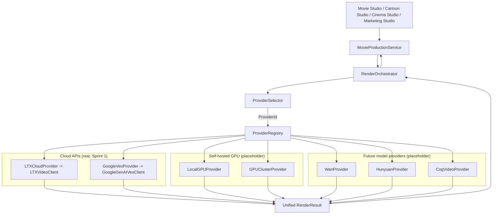

# Render Orchestrator Architecture

Status: **Sprint 1 — foundation laid, not yet integrated.** Every class described
here exists and compiles (`services/rendering/`), but nothing in
`MovieProductionService` or `MovieProductionFactory` calls it yet. Movie Studio's
real production path today is still the direct
`MovieProductionService -> VeoService -> (LTXVideoClient | GoogleGenAIVeoClient)`
flow built in earlier sprints. This document describes the parallel
architecture Sprint 2+ will wire in — replacing that direct call with a call
into `RenderOrchestrator` — without changing `MovieProductionService`'s public
API or any product UI.

## Why this exists

Every product in ReelForge (Movie Studio today; Cartoon Studio, Cinema Studio,
Marketing Studio, and future products later) eventually needs to render video.
Today that means a paid cloud API (Google Veo, LTX). Tomorrow it may mean a
self-hosted GPU, a GPU cluster, or a different model provider entirely (Wan,
Hunyuan, CogVideo) — chosen per request based on cost, GPU availability, queue
depth, or latency budget. No product should have to know which backend
actually rendered its video, or change a single line when that backend
changes. `RenderOrchestrator` is the seam where that decision is made, once,
for every product.

## Architecture diagram

This is exactly the flow specified for Sprint 1: `Movie Studio ->
MovieProductionService -> Render Orchestrator -> Provider Selector -> Provider
Registry -> Cloud API | GPU | GPU Cluster -> Unified Render Result`.

## Execution flow

1. A caller (eventually `MovieProductionService`, today a test/future caller
   only) builds a `RenderRequest` (`{ prompt, negativePrompt?, aspectRatio?,
   durationSeconds?, quality? }`) and calls `RenderOrchestrator.render()`.
2. `RenderOrchestrator` mints its own `jobId` (`generateJobId()`) —
   independent of whatever id the underlying provider uses internally.
3. It asks `ProviderSelector.select()` for a `ProviderId`. Today that is a
   1:1 mirror of `VIDEO_PROVIDER` (`LTX` or `GOOGLE`, default `GOOGLE`) — the
   exact same logic already live in
   `MovieProductionFactory.resolveVideoProvider()`. **No behavior change.**
4. It asks `ProviderRegistry.resolve(providerId)` for the concrete
   `RenderProvider` instance, constructing it lazily (and caching it) on
   first use — so a provider whose credentials aren't configured only
   throws if it's actually selected.
5. It calls `provider.generate(request)` and records `{ providerId,
   providerJobId }` against its own `jobId` in an in-memory map.
6. It returns a `RenderResult` with `jobId` and `provider` normalized to its
   own values, so callers never see a provider-specific id or name unless
   they choose to (i.e. it's echoed in `provider`, not hidden).
7. Later, `checkStatus(jobId)` / `download(jobId)` look up the tracked
   `(providerId, providerJobId)` pair and delegate to that same provider
   instance, unifying the result the same way.
8. Every attempt (success or failure) is recorded to `RenderMetrics` if one
   was injected.

A provider-side failure never throws out of `render()` — it comes back as a
normal `RenderResult` with `status: "FAILED"` and `error` set, so callers
have one code path for "the render didn't work," not two.

## Provider flow

- **`RenderProvider`** (`interfaces/RenderProvider.ts`) is the contract every
  backend implements: `generate()`, `checkStatus()`, `download()`, all
  returning `RenderResult`.
- **`ProviderRegistry`** maps `ProviderId -> RenderProvider` via lazy
  factories, mirroring the existing lazy-thunk pattern in
  `ai/providers/ProviderFactory.ts`.
- **Cloud providers are adapters, not reimplementations.** `LTXCloudProvider`
  wraps the existing `LTXVideoClient`; `GoogleVeoProvider` wraps the existing
  `GoogleGenAIVeoClient` (exported from `MovieProductionFactory.ts` for
  exactly this purpose — see that file's `GoogleGenAIVeoClient` comment).
  Both extend `BaseVeoClientProvider`, which holds the one shared
  translation from the existing `VeoClient` contract
  (`VeoRequest`/`VeoResponse`/`GeneratedVideo`) to `RenderResult` — so that
  translation exists exactly once, not once per provider.
- **GPU and future placeholders** (`LocalGPUProvider`, `GPUClusterProvider`,
  `WanProvider`, `HunyuanProvider`, `CogVideoProvider`) all extend
  `NotImplementedRenderProvider`, whose three methods throw `"Provider not
  implemented."` — registered today so the full roster is addressable, wired
  into nothing until a real backend replaces each one.

## Future GPU migration plan

The entire point of this layer is that migrating from cloud APIs to
self-hosted GPU rendering touches **only** `services/rendering/`:

1. Implement `LocalGPUProvider` (and later `GPUClusterProvider`) for real:
   replace the `NotImplementedRenderProvider` base with real
   generate()/checkStatus()/download() logic against the GPU worker's API
   (HTTP, gRPC, a job queue — whatever it ends up being), returning
   `RenderResult` exactly like `BaseVeoClientProvider` does today.
2. Extend `ProviderSelectionContext` (`ProviderSelector.ts`) with the real
   signals already stubbed there — `gpuAvailable`, `gpuQueueDepth`,
   `maxCost`, `priority`, `maxLatencyMs` — and implement `select()`'s TODO to
   route to `"LOCAL_GPU"`/`"GPU_CLUSTER"` when appropriate, falling back to
   `"LTX"`/`"GOOGLE"` otherwise.
3. Nothing else changes. `RenderOrchestrator`'s public API
   (`render`/`checkStatus`/`download`, all returning `RenderResult`) is
   identical before and after. Once `MovieProductionService` (or its
   eventual successor) calls `RenderOrchestrator` instead of `VeoService`
   directly (Sprint 2+), Movie Studio — and Cartoon Studio, Cinema Studio,
   Marketing Studio, and any future product built the same way — never
   needs to change again to pick up a new backend. The migration is a
   selection-logic change plus two new provider implementations, not a
   product-facing rewrite.

## Cost optimization strategy

`CostOptimizer` (architecture only in Sprint 1 — every pricing method
throws with a `TODO`) is the intended second input to provider selection,
alongside GPU availability:

- `recordRender()` — capture every completed render's
  `{ provider, durationSeconds, resolution, cost, timestamp }` for later
  analysis. Already called structurally (no-op today) wherever
  `RenderMetrics.record()` is called from `RenderOrchestrator`.
- `calculateCost()` — once real per-provider pricing is known (LTX $/sec,
  Google $/sec, self-hosted GPU $/hour amortized across concurrent jobs),
  compute the actual cost of a completed render.
- `estimateCost()` — pre-flight cost estimate for a candidate request/
  provider pair, so `ProviderSelectionContext.maxCost` can actually be
  enforced.
- `recommendProvider()` — given a set of candidate `ProviderId`s (e.g.
  every provider capable of the requested resolution), rank by estimated
  cost first, then by latency/queue depth, and return the best choice.

Once implemented, `ProviderSelector.select()` calls into
`CostOptimizer.recommendProvider()` instead of the current fixed
`VIDEO_PROVIDER` switch — again, a change entirely inside
`services/rendering/`, invisible to every product built on top of it.
